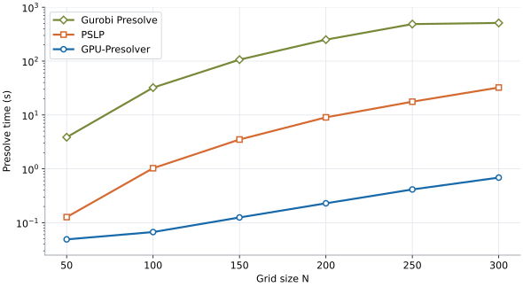

# GPU-Presolver

GPU-Presolver is a C++/CUDA package for GPU-based LP presolve and postsolve.
It reduces a linear program before an external solver solves it, then
recovers a solution in the original model space.

The package supports continuous linear programs of the form:

```text
minimize    cᵀx + c0
subject to  AL ≤ Ax ≤ AU
             l ≤ x  ≤ u
```

## Installation

Requires CMake 3.24+, a C++17 compiler, CUDA Toolkit (nvcc and cuSPARSE),
and an NVIDIA GPU. Tested with CUDA 12.8. Run from the project root:

```bash
cmake -S cpp -B cpp/build -DCMAKE_BUILD_TYPE=Release -DCMAKE_CUDA_ARCHITECTURES=80
cmake --build cpp/build --parallel
```

Set `CMAKE_CUDA_ARCHITECTURES` for your GPU's compute capability
(`80` means 8.0; at least 6.0 is required), also in projects embedding this package.
To link from a C++17/CUDA project, replace the path and `YOUR_TARGET` below:

```cmake
find_package(CUDAToolkit REQUIRED)
add_subdirectory(path/to/GPU-Presolver/cpp gpu-presolver-build EXCLUDE_FROM_ALL)
target_link_libraries(YOUR_TARGET PRIVATE gpu_presolver_core CUDA::cudart)
```

## Usage

**Command line:**

After building, run either command from the project root. Replace `model.mps`
with an uncompressed MPS file for a continuous minimization LP.
Integer markers and integer-specific bounds are rejected.

```bash
# Run presolve and print status, dimensions, and timing
./cpp/build/gpu_presolver_mps model.mps

# Run presolve and export the reduced LP
./cpp/build/gpu_presolver_export_reduced model.mps reduced/
```

The exporter creates `reduced/` and writes `meta.txt` plus binary matrix,
objective, and bound arrays. Each command runs presolve independently.
Status `ok` means presolve detected neither infeasibility nor unboundedness;
an external solver is still needed to solve the reduced LP.

**C++:** prepare `LPInfoGpu lp` with device CSR matrices `A`, `AT = Aᵀ`, device
vectors `c/AL/AU/l/u`, and host `obj_constant`. Use zero-based int32 indices
and double values. See [data structures](cpp/include/gpu_presolver/presolve/presolve_structs.hpp).

```cpp
#include <cuda_runtime.h>
#include "gpu_presolver/presolve/gpu_presolve.hpp"
#include "gpu_presolver/presolve/gpu_postsolve.hpp"
using namespace gpu_presolver::presolve;

// Inside your application:
PresolveParams params;
params.max_iters = 10;
auto s = run_gpu_presolve_with_reduced_lp(lp, params);
if (!s.has_infeasible && !s.has_unbounded) {
    // Your solver must solve s.reduced_lp in its row/column order and supply:
    // x_red: primal values; y_red: row duals; z_red: reduced costs.
    // All are device arrays: x_red/z_red have reduced_cols entries,
    // and y_red has reduced_rows entries.
    auto out = postsolve_gpu(x_red, y_red, z_red, s.record, &lp);
    // Use out.x_org, out.y_org, out.z_org, then release them.
    cudaFree(out.x_org);
    cudaFree(out.y_org);
    cudaFree(out.z_org);
}
free_gpu_presolve_reduced_lp(s);
```

The summary contains the reduced model, recovery record, status, dimensions,
timing, and objective shift. Keep `lp` and `s` alive through postsolve;
the caller manages the input LP and reduced-solution arrays.
Duals use `c − Aᵀy − z = 0`. Postsolve does not guarantee dual feasibility
or complementarity; check recovered feasibility/KKT separately.

## Parameters

Set these fields in `PresolveParams` when calling the C++ API:

| Parameter | Default | Purpose |
| --- | --- | --- |
| `max_iters` | `10` | Maximum scheduler iterations |
| `max_time` | `∞` | Soft time limit in seconds, checked between presolve phases |
| `use_tiered_scheduler` | `true` | Tiered scheduler; `false` selects fixed scheduling |
| `enable_structure_specific_rules` | `true` | Enable the five block reductions |

`enable_structure_specific_rules = false` disables all block reductions.
Further tuning fields: [PresolveParams](cpp/include/gpu_presolver/presolve/presolve_structs.hpp).

The CLI supports [selected environment overrides](cpp/tools/gpu_presolver_tool_common.hpp), for example:

```bash
GPUPRESOLVER_MAX_ITERS=20 ./cpp/build/gpu_presolver_mps model.mps
```

## Performance

The table compares presolve time and the percentage of original nonzeros retained
by GPU-Presolver, PSLP, and Gurobi Presolve on 49 Mittelmann LPs, 18 large MIPLIB
LP relaxations, and 20 QAP-derived LPs (QAP20).
Times use a 10-second shifted geometric mean (SGM10); retained percentages are
arithmetic means. Lower is better for both metrics.

| Dataset | Presolver | Presolve time (s) | Nonzeros retained (%) |
| --- | --- | ---: | ---: |
| **Mittelmann** | Gurobi Presolve | 4.183 | 72.2 |
|  | PSLP | 1.264 | 79.8 |
|  | GPU-Presolver | **0.325** | 74.9 |
| **MIPLIB Large** | Gurobi Presolve | 9.747 | 52.5 |
|  | PSLP | 3.314 | 60.8 |
|  | GPU-Presolver | **0.988** | 55.9 |
| **QAP20** | Gurobi Presolve | 184.791 | 40.5 |
|  | PSLP | 12.631 | 40.5 |
|  | GPU-Presolver | **2.113** | 40.5 |

Across these benchmark groups, GPU-Presolver achieves SGM10 presolve-time speedups of
**3.4–6.0× over PSLP** and **9.9–87.5× over Gurobi Presolve**, while achieving
reduction ratios comparable to those of Gurobi Presolve and PSLP.

These heat-source localization LPs estimate heat-source intensities from
temperature measurements on a 3D grid. The figure compares presolve times across
six grid sizes, up to 216 million nonzeros, with a logarithmic time axis.



Across these six instances, GPU-Presolver achieves the lowest presolve time,
with maximum speedups of **47.0× over PSLP** and **1,175.8× over Gurobi Presolve**,
while maintaining comparable reduction ratios.

*Setup:* GPU-Presolver uses one NVIDIA H100 80 GB GPU; PSLP 0.0.11 and
Gurobi Presolve (Gurobi 12.0.2) run on Intel Xeon Gold 6548Y+ CPUs.
Times cover presolve only, excluding MPS parsing and CPU–GPU transfers.
